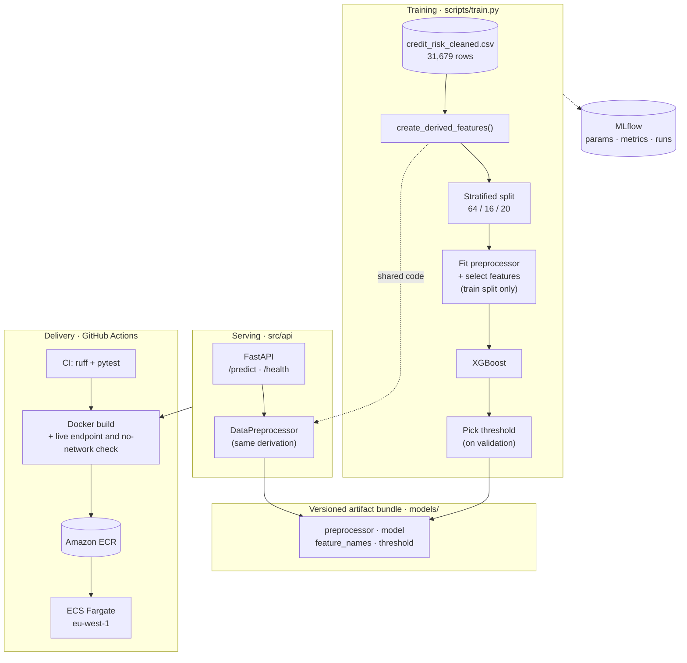

# Credit Risk Engine

Probability-of-default scoring for consumer loans: a calibrated XGBoost model served as a FastAPI
service, containerised and deployed to AWS ECS Fargate.

[](https://github.com/AntonioAlbaladejo/credit-risk-engine/actions/workflows/ci.yml)
[](https://www.python.org/downloads/)
[](LICENSE)
[](https://github.com/astral-sh/ruff)

---

## Overview

Given a loan application — income, employment, home ownership, requested amount, interest rate,
credit history — the service returns the probability of default, a binary decision at a tuned
threshold, and the threshold it used.

Trained on 31,679 historical applications at a 21.5% default rate, it reaches **0.9495 ROC-AUC** and
**0.9051 PR-AUC** on a held-out test split at an expected calibration error of **0.0082** — close
enough to read the output as a real probability rather than an arbitrary score. That is the point of
the design: a calibrated score can be repriced, turned into expected loss, or moved to a different
operating point without retraining. A binary yes/no cannot.

---

## Results

Measured on the 6,336-row test split, held out from every `fit` call and from the threshold search.
Seed `42` throughout. XGBoost, `max_depth=4`, `n_estimators=300`, no class weighting, threshold 0.39,
24 features.

| ROC-AUC | PR-AUC | Brier ↓ | Calibration error ↓ | Recall | Precision | F1 |
|---|---|---|---|---|---|---|
| **0.9495** | **0.9051** | **0.0516** | **0.0082** | 0.7560 | 0.9348 | 0.8360 |

At the tuned threshold the model catches 75.6% of real defaults, and 93.5% of the applications it
rejects would have defaulted. Mean predicted probability is 0.2153 against an observed rate of
0.2154.

### Model selection

Four algorithms under an identical pipeline — same split, same preprocessor, same 24 features, no
imbalance handling anywhere — so the only variable between rows is the algorithm.

| Model | ROC-AUC | PR-AUC | Brier ↓ | Precision | Recall | F1 |
|---|---|---|---|---|---|---|
| Logistic Regression | 0.8750 | 0.7398 | 0.0986 | 0.6771 | 0.6960 | 0.6864 |
| Random Forest | 0.9315 | 0.8843 | 0.0565 | 0.9416 | 0.7436 | 0.8309 |
| **XGBoost** | **0.9495** | **0.9051** | **0.0516** | **0.9348** | **0.7560** | **0.8360** |
| SVM (RBF) | 0.9041 | 0.8464 | 0.0693 | 0.8738 | 0.6952 | 0.7744 |

XGBoost wins every column, so the choice hides no trade-off. Logistic regression is the informative
loser: trailing by 7.5 ROC-AUC and 17 PR-AUC points says the boundary is genuinely non-linear —
grade, intent and home ownership interact with loan-to-income rather than adding up.

Regenerate with `uv run python scripts/train.py [--baselines]`, which writes
[`baseline_comparison.csv`](results/baseline_comparison.csv) and
[`leakage_and_weighting_comparison.csv`](results/leakage_and_weighting_comparison.csv).

---

## Design decisions

### Every `fit` happens inside the training split

The preprocessor, feature selector and threshold search see training or validation data only; test is
touched once, at the end. An earlier notebook pipeline fitted and selected over the full dataset
first.

| Arm | ROC-AUC | PR-AUC | Brier ↓ | Mean predicted | Threshold |
|---|---|---|---|---|---|
| Old pipeline: leaky + weighted | 0.9492 | 0.9046 | 0.0682 | 0.3035 | 0.70 |
| Clean split + weighted | 0.9492 | 0.9046 | 0.0682 | 0.3035 | 0.70 |
| **Clean split, unweighted** (shipped) | **0.9495** | **0.9051** | **0.0516** | **0.2153** | 0.39 |


Measured side by side the leak did **not** inflate the metrics — the leaky arm scored marginally
worse — but the methodology was wrong regardless, and a pipeline that is only accidentally correct
will not stay correct. Each arm is an MLflow run with `leaky` and `weighted` logged as separate
parameters, so either factor can be isolated: fixing the leak alone moves Brier almost nothing, while
dropping the weighting moves it a long way.

### No SMOTE, and no class weighting either

At 21.5% positives (3.64:1) the imbalance is mild. Three SMOTE variants were measured and all three
degraded ROC-AUC and PR-AUC; 15% of the synthetic rows carried a `loan_grade` block that was not a
valid one-hot, because interpolating over already-encoded columns invents categories that do not
exist. And once the threshold is tuned every arm converges to an F1 between 0.8370 and 0.8447 — the
benefit oversampling promises is what threshold tuning already delivers.


Class weighting was then dropped for calibration. Both curves come from the same algorithm, features
and split; only `scale_pos_weight` differs. The weighted model systematically over-predicts risk —
calibration error 0.0893 against 0.0082 — and gives up 0.0003 ROC-AUC for it. It pushes mean
predicted probability to 0.3035 against a true rate of 0.2154, dragging the optimal threshold to
0.70. Unweighted, no decile deviates more than 2.5 points and Brier improves by 24%.

### The threshold is a tuned artifact, not 0.5


It is chosen on the **validation** split by maximising F1, then applied unchanged to test — picking
it on test would leak the test set into the reported operating point. The curve is flat between
roughly 0.3 and 0.7, so the cut-off can be moved on business grounds without collapsing the model
([full sweep](results/threshold_optimization.csv)). The service returns `threshold_used` in every
response rather than leaving the caller to assume.

### Training and serving share one implementation

`create_derived_features()` in [`src/preprocessing.py`](src/preprocessing.py) is imported by both the
training script and the serving path. It previously existed twice and the copies had already drifted
— different zero-division handling, different bucket dtypes. That is train/serve skew: it produces no
error and no failing test, just quietly wrong predictions.

The preprocessor, feature list, model and threshold are likewise one versioned bundle, produced by a
single run and loaded together at startup. MLflow lookup is opt-in, so an unreachable tracking server
degrades to the local artifacts instead of blocking startup for 247 seconds of retry backoff.

---

## Architecture and delivery



CD triggers only on a successful CI run, builds the image, **starts the container and calls
`/health`, `/predict` and `/regulation/search` against it**, then runs it once more with
`--network none`, and only then pushes to ECR and deploys to Fargate. Those checks matter more than
they look: the step they replaced ran `python -c "import src"`, which passes even when the model
artifacts are missing from the image entirely. The offline run is there for the same reason one
level down — the runner has network, so an image that had lost its baked embedding weights would
download them on first use, pass every other check, and only fail on Fargate.


---

## Running it

Requires Python 3.11+ and [uv](https://docs.astral.sh/uv/getting-started/installation/).

```bash
git clone https://github.com/AntonioAlbaladejo/credit-risk-engine.git
cd credit-risk-engine
uv sync --all-groups
uv run uvicorn src.api.main:app --reload --port 8000   # docs at :8000/docs
```

```bash
curl -X POST http://localhost:8000/predict \
  -H 'Content-Type: application/json' \
  -d '{"person_age": 23, "person_income": 24000, "person_home_ownership": "RENT",
       "person_emp_length": 1, "loan_intent": "DEBTCONSOLIDATION", "loan_grade": "E",
       "loan_amnt": 12000, "loan_int_rate": 16.0, "loan_percent_income": 0.5,
       "cb_person_default_on_file": 1}'
```

```json
{
  "prediction": 1,
  "probability_default": 0.9998000264167786,
  "risk_level": "high_risk",
  "threshold_used": 0.39,
  "recommendation": "Reject application"
}
```

The corpus and its vector index are versioned, so the same clone searches the legislation with no
ingestion step. Write the passage you would expect the law to contain; it is matched in place of the
question, and the question alone still decides whether anything comes back at all.

```bash
curl -X POST http://localhost:8000/regulation/search \
  -H 'Content-Type: application/json' \
  -d '{"question": "Do we have to let someone contest an automated rejection?",
       "hypothetical_passage": "The data subject shall have the right to obtain human intervention on the part of the controller, to express his or her point of view and to contest the decision."}'
```

```json
{
  "passages": [
    {
      "citation": "GDPR, Article 22(1-4) - Automated individual decision-making, including profiling",
      "text": "GDPR, Article 22(1-4) ...\n\n1. The data subject shall have the right not to be ...",
      "source_url": "https://eur-lex.europa.eu/legal-content/EN/TXT/HTML/?uri=CELEX:32016R0679",
      "retrieved_on": "2026-08-16"
    }
  ]
}
```

Ask it something the legislation cannot answer — *what is our current model AUC?* — and
`passages` comes back empty with a `note` saying which of the two refusals happened. Four more
passages follow the one above, and shortening that hypothetical passage is enough to push Article
22 out of first place, which is the clearest demonstration of what it buys.

The 647 MB Docker image carries the model artifacts, the regulatory corpus with its vector index and
the embedding weights, so a fresh clone builds a container that both scores applications and
searches the legislation, healthy in about 5 seconds. Training tools — MLflow, Evidently,
seaborn — and the CUDA build of XGBoost are dev-only dependencies, and none reach the runtime
layer.

```bash
docker build -t credit-risk-engine:local . && docker run --rm -p 8000:8000 credit-risk-engine:local
uv run pytest                                           # 183 tests, ~6s
uv run python scripts/train.py --baselines              # reproduce the comparison tables
uv run python scripts/train.py --save clean-unweighted  # promote a run to models/
```

---

## API

| Method | Endpoint | Description |
|---|---|---|
| `GET` | `/health` | `200` when the model is loaded, `503` when it is not |
| `GET` | `/model/info` | Model type, threshold, and the 24 feature names in order |
| `POST` | `/predict` | Score one application |
| `POST` | `/predict/batch` | Score up to 100 applications in one call |
| `POST` | `/regulation/search` | Passages of the GDPR and the AI Act bearing on a question, with citations |
| `GET` | `/docs` · `/redoc` | OpenAPI documentation |


Pydantic v2 schemas are the contract and FastAPI generates the documentation from them, so it cannot
drift from what the service accepts, and requests can be sent straight from the page. Bounds live in
[`src/config.py`](src/config.py) to match the ranges seen in training: `loan_int_rate` has a floor
of 1.0 rather than 0 because training data runs
5.42 to 23.22 in percent units, so a caller sending a fraction (`0.08` for 8%) is rejected with a
`422` rather than silently scaled 3.5 standard deviations below anything the model has seen.
`/health` returns `503` rather than `200` with an `unhealthy` body because a load balancer reads the
status code, not a payload.

---

## LLM surface: explanations and regulatory grounding

An MCP server ([`src/mcp_server.py`](src/mcp_server.py)) exposes the model to LLM clients such as
Claude Desktop or Claude Code over JSON-RPC on stdio. There is no LLM on this side: the client's own
model reads the tool descriptions and decides when to call them, which makes those descriptions
prompt surface rather than developer documentation.

| Tool | What it answers |
|---|---|
| `assess_loan_application` | Probability of default, the decision at the tuned threshold, and the reason codes that drove it |
| `get_model_info` | The model itself — type, threshold, features |
| `search_regulation` | The passages of the GDPR and the EU AI Act bearing on a question, each with its citation. Takes an optional hypothetical passage the calling model writes first |

**Reason codes, not raw SHAP.** [`src/explainer.py`](src/explainer.py) runs exact TreeSHAP against
the native booster and groups per-feature contributions into named reasons. The client receives
derived reasons and never the raw application, and the tool description states that contributions
are log-odds — they add up, but they are not shares of the probability and must never be presented
as percentages.

**Retrieval that knows when to stay quiet.** The corpus is the GDPR and the AI Act pulled from
EUR-Lex, split on their ELI anchors into **759 passages** sized against the embedding model's
512-token window, each carrying the citation, source URL and consultation date that let a reader
check it. Search is an exact cosine scan over `BAAI/bge-small-en-v1.5`; recitals are demoted relative
to articles because explanatory prose reads like a question and outranks the provision that actually
binds.

Below a tuned similarity threshold the tool returns **no passages at all**, and says so. Most
questions put to a system like this one are about the product, the model or the business, and a
provision cited for one of those is worse than silence — it reads as grounding and is not. It is
measured against a hand-labelled set of **161 questions**, 94 for fitting and 67 held out, written
to look like what the tool actually receives: terse fragments, questions that ramble for a
paragraph, false premises, banking jargon, and a third that the corpus genuinely cannot answer.
Every unanswerable one carries a note justifying that label, because an empty label is a claim
about the corpus. On the held-out split the plain path reaches **72.0% hit-rate@5** and handles 39
of 67 questions correctly. Five alternatives were measured and dropped — a BM25 hybrid, a
cross-encoder reranker, indexing headings separately, merging an internal policy document into the
same index, and four larger embedding models.

**Two signals, because ranking and abstention are different problems.** Questions arrive in business
language the legislation never uses — *postal code*, *AUC*, *revalidated*, *vendor* appear nowhere in
the corpus — so `search_regulation` accepts an optional `hypothetical_passage`: the provision the
calling model would expect to find, written in the register of the law before it calls. Matching
passage against passage instead of question against passage lifts hit-rate@5 on the held-out split
from 72.0% to **98.0%**. That figure survives a change of writer: a second batch of 161 passages,
written independently with no sight of the corpus, the retriever or the first batch, shares no
passage with it and yet finds the same 49 of the 50 answerable held-out questions, over a threshold
sweep identical to the first batch's. The invented passage takes the ranking, and the real question
keeps the veto over whether to answer at all — not because the passage is a poor judge of that, but
because it is a worse one to act on: its score orders groundable questions slightly better (AUC 0.77
against 0.71) and yet every threshold fitted to it serves more wrong citations, 23.6 against 19.1
per cross-validated fold. Ordering well and cutting well are not the same property.

**A third arm vetoes on the modality of the question, not on similarity.** The corpus states what
the law requires, so it can answer *must we do X* and structurally cannot answer *did we do X* — for
which it returns the provision governing X, a match every relevance model endorses. A cross-encoder
reranker was measured on exactly these and scored them above 60% of the questions the corpus really
does answer, so it cannot object; the signal is grammatical, not semantic. Similarity to three
deontic prototypes minus similarity to three evidential ones separates them, and cross-validated
inside the fitting split the pair wins 7 seeds of 8 against the corpus score alone.

That arrangement handles **48 of 67 held-out questions correctly against 39** for the plain path,
and the shape of the gain matters more than the total: it answers 41 correctly where the plain path
answers 21, and serves **two fewer** wrong citations doing it. The modality arm is what refuses the
last five, trading 2 real answers for 3 fewer wrong citations there — a trade worth making only
because a confident wrong citation is the worst outcome this tool has. Abstention is still the weak
half: it stays quiet on 7 of the 18 questions it should refuse, against 18 for the plain path. A
second veto arm that answered whenever the two rankings independently agreed on a passage looked
like it fixed that, and won on the first, smaller question set. Cross-validated inside the fitting
split it lost 7 folds out of 8, costing 3.6 correct answers and 4.4 extra wrong citations, so it
was dropped. The hypothetical passage is optional throughout; a client that omits it gets the plain
path unchanged.

```bash
uv run python -m scripts.ingest_corpus   # build corpus/ and its vector index
```

The index is versioned alongside the model artifacts, because CD builds the image from a fresh
checkout and anything generated is simply absent from it. Rebuild it with the corpus and never on
its own: `from_files()` compares chunk ids and refuses a pair that disagree, since an index built
from a stale corpus serves the right-looking text under the wrong citation. Without an index the
tool raises an actionable error and the endpoint answers `503` while the scoring paths keep
working, which is why the corpus and the scoring bundle load through separate lazy accessors.
[`.mcp.json`](.mcp.json) registers the server for any MCP client opened in this directory.

**The same retrieval over HTTP.** `POST /regulation/search` returns the payload `search_regulation`
returns, built by one method on the retriever that both callers share: the same text served under
one citation on stdio and another over HTTP is the drift that indirection exists to prevent. The
endpoint's docstring and field descriptions become its OpenAPI description, which is the REST
equivalent of the tool description an MCP client reads — a weaker channel, because a caller is free
not to read it.

The embedding model is baked into the image at build time rather than fetched on first use, so an
unreachable HuggingFace cannot keep a task from starting; CD asserts it by running the image with
`--network none`. The corpus is warmed in a background thread at startup, because loading it costs
12.6 s on the 0.5 vCPU the task is sized at and the first caller after a rollout would otherwise pay
it. Retrieval adds 205 MB to the image, and resident memory settles at ~345 MB of the task's 1024
against ~130 MB for the scoring model alone — flat across predictions and searches once warm. On
that hardware a search costs about what a prediction costs.

---

## Stack and data

| Layer | Tools |
|---|---|
| Modelling | XGBoost, scikit-learn, pandas, NumPy |
| Tracking · monitoring | MLflow, Evidently |
| Serving | FastAPI, Pydantic v2, uvicorn |
| LLM surface | MCP SDK, SHAP, fastembed |
| Packaging · quality | uv, Docker multi-stage, pytest, ruff |
| Delivery | GitHub Actions, Amazon ECR, ECS Fargate (eu-west-1) |

The [Credit Risk Dataset](https://www.kaggle.com/datasets/laotse/credit-risk-dataset) from Kaggle:
32,581 loan applications, 11 features, binary `loan_status` target. Cleaning leaves **31,679 rows at
a 21.5% default rate** (3.64:1). Feature engineering adds five derived columns, expanding to 40 after
one-hot encoding; a three-stage filter (correlation, tree importance, variance) fitted on the
training split alone reduces that to 18, and one-hot blocks left partially selected are then restored
whole, giving the **24 features** the model uses. Raw data is not committed.

---

## Limitations and open work

- **Most of the suite mocks `joblib.load` with an autouse fixture**, so it exercises the code paths
  rather than the shipped model. `tests/test_inference_real.py` opts out of that mock and pins six
  known applications to the probabilities the real bundle assigns them, which is what catches a
  reordered feature list or a preprocessor from a different run; the rest still proves nothing about
  the artifacts.
- **Grade F is still under-predicted** by 0.068 on the 51 test rows that carry it. Restoring the
  one-hot block stopped F and G from being scored as B, but 7 sparse dummies share no strength
  between neighbouring grades; an ordinal encoding with `monotone_constraints` is the follow-up.
- **The regulatory search knows when to answer far better than when to stay quiet.** With a
  hypothetical passage it finds the right provision for 98% of the questions the corpus can answer,
  but of the 18 held-out questions it should refuse it refuses only 7. The modality arm that lifted
  that from 4 also refuses two questions that are plainly deontic — *what do we have to tell the
  customer* — because a bi-encoder reads their topic more strongly than their grammar. Fixing that
  means new anchors chosen against a question set nobody has read yet, not against these.
  Abstention matters less than that number suggests, though: 48 answers written from these payloads
  by a model that was not told its faithfulness was being measured, then graded blind, put **13 of
  the 13 wrong-citation cases** on record as flagging the gap rather than asserting the law, and no
  claim invented a fact about this organisation. What the answers do get wrong is following a
  cross-reference — a returned passage says *without prejudice to Article 78* and the model fills in
  Article 78 from memory. Returning the referenced provision as well was built and measured, and
  tripled overclaiming: with twice the material the model shifts from citing to interpreting. Both
  measurements are one generator, one pass, on the fitting split, and graded by a model of the same
  family as the one that wrote them.
- **The retrieval numbers are fitted and read on question sets that no longer surprise it.** Every
  threshold here was chosen on the fitting split, but the held-out split has been read repeatedly
  across this work, and a set looked at many times stops being held out. Enlarging the set from 101
  to 161 questions with more realistic phrasing already overturned one result that had looked solid
  on the smaller set, which is the honest argument for treating the current ones as provisional. The
  two batches of hypothetical passages that agree question for question were nonetheless written
  by the same model family, so the writer sensitivity that is bounded here is between independent
  drafts, not between vendors.
- **Nothing enforces how a caller uses the passages.** Over MCP the tool description travels with
  every call. Over HTTP the same guidance lives only in the OpenAPI description, which a client can
  ignore: the service can return citations, and a note saying so when it has nothing, but it cannot
  make a caller quote them.
- **CORS is wide open** (`allow_origins=["*"]`) and the Evidently report compares against a
  three-row hand-written reference file, so its drift numbers are not meaningful yet.

---

## License

MIT — see [LICENSE](LICENSE).

## Author

**Antonio Albaladejo Soriano** ·
[LinkedIn](https://www.linkedin.com/in/antonio-albaladejo-soriano-3133211b7/)
