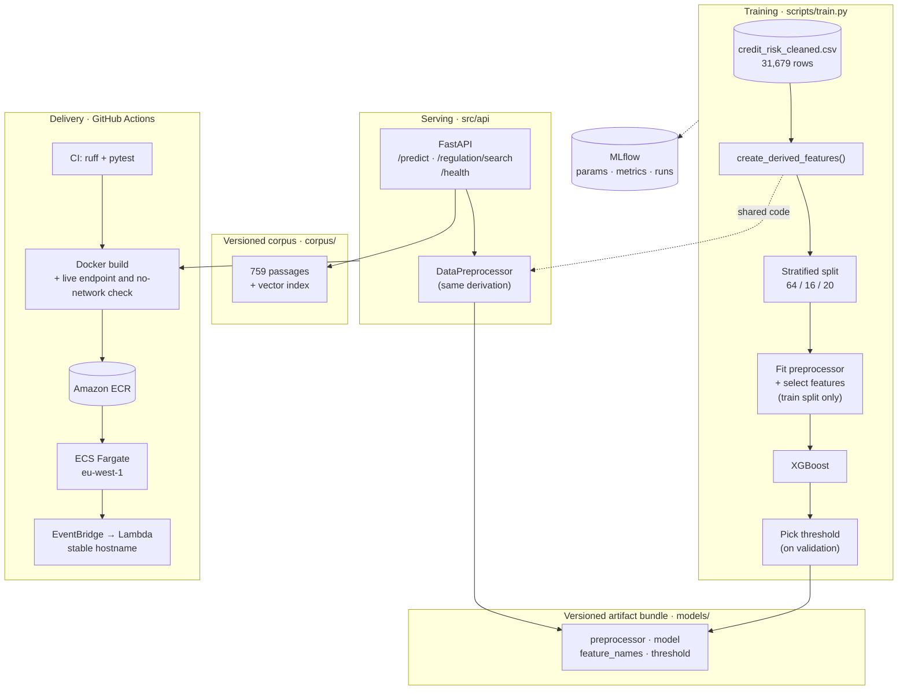

# Credit Risk Engine

Probability-of-default scoring for consumer loans: a calibrated XGBoost model served as a FastAPI
service, containerised and deployed to AWS ECS Fargate — with the GDPR and EU AI Act provisions
behind a decision retrievable from the same container.

[](https://github.com/AntonioAlbaladejo/credit-risk-engine/actions/workflows/ci.yml)
[](https://www.python.org/downloads/)
[](LICENSE)
[](https://github.com/astral-sh/ruff)

[Results](#results) · [Design decisions](#design-decisions) · [Architecture](#architecture-and-delivery) ·
[Running it](#running-it) · [API](#api) · [LLM surface](#llm-surface-explanations-and-regulatory-grounding) ·
[Limitations](#limitations-and-open-work)

---

## At a glance

| | |
|---|---|
| **What it does** | Scores a loan application for probability of default, explains it as reason codes, and retrieves the GDPR / EU AI Act passages bearing on a question — with citations, or nothing when the corpus cannot answer |
| **Model** | XGBoost on 31,679 applications at a 21.5% default rate. **0.9495 ROC-AUC · 0.9051 PR-AUC · 0.0082 calibration error**, held out, against three measured alternatives |
| **The decision** | Threshold tuned on validation (**0.39**) and returned in every response — not an assumed 0.5 |
| **Serving** | FastAPI + Pydantic v2. Preprocessor, model, feature list and threshold load as one versioned bundle; `/health` is `503` until the model is really in memory |
| **Retrieval** | 759 passages of the two acts, **98.0% hit-rate@5** held out, and a tuned threshold below which it returns nothing and says so |
| **LLM surface** | An MCP server over stdio and `POST /regulation/search` over HTTP, sharing one payload builder |
| **Delivery** | GitHub Actions → ECR → ECS Fargate (eu-west-1). The image is started and called before it is pushed, then run again with no network |
| **Quality** | 193 pytest tests in ~6 s, ruff clean, six pinned against the real artifacts |

Four decisions shape everything below:

- **Every `fit` happens inside the training split.** The leak it replaced was measured, not assumed —
  it did not inflate the metrics, and was fixed anyway.
  [↓](#every-fit-happens-inside-the-training-split)
- **The score is calibrated and the threshold is a separate artifact**, so the operating point moves
  without retraining. [↓](#no-smote-and-no-class-weighting-either)
- **Training and serving share one feature implementation**, because the two copies that preceded it
  had already drifted apart in silence. [↓](#training-and-serving-share-one-implementation)
- **The retrieval is measured on when it stays quiet**, not only on what it finds: a third of the 161
  hand-labelled questions are ones the corpus cannot answer.
  [↓](#llm-surface-explanations-and-regulatory-grounding)

---

## Results

The 6,336-row test split, held out from every `fit` call and from the threshold search. Seed `42`.
XGBoost, `max_depth=4`, `n_estimators=300`, no class weighting, threshold 0.39, 24 features.

| ROC-AUC | PR-AUC | Brier ↓ | Calibration error ↓ | Recall | Precision | F1 |
|---|---|---|---|---|---|---|
| **0.9495** | **0.9051** | **0.0516** | **0.0082** | 0.7560 | 0.9348 | 0.8360 |

The model catches 75.6% of real defaults, and 93.5% of the applications it rejects would have
defaulted. Mean predicted probability is 0.2153 against an observed 0.2154.

### Model selection

Four algorithms under an identical pipeline — same split, same preprocessor, same 24 features, no
imbalance handling anywhere — so the only variable between rows is the algorithm.

| Model | ROC-AUC | PR-AUC | Brier ↓ | Precision | Recall | F1 |
|---|---|---|---|---|---|---|
| Logistic Regression | 0.8750 | 0.7398 | 0.0986 | 0.6771 | 0.6960 | 0.6864 |
| Random Forest | 0.9315 | 0.8843 | 0.0565 | 0.9416 | 0.7436 | 0.8309 |
| **XGBoost** | **0.9495** | **0.9051** | **0.0516** | **0.9348** | **0.7560** | **0.8360** |
| SVM (RBF) | 0.9041 | 0.8464 | 0.0693 | 0.8738 | 0.6952 | 0.7744 |

XGBoost wins every column, so the choice hides no trade-off. Logistic regression is the informative
loser: trailing by 7.5 ROC-AUC and 17 PR-AUC points says the boundary is genuinely non-linear.

Regenerate with `uv run python scripts/train.py [--baselines]`, which writes
[`baseline_comparison.csv`](results/baseline_comparison.csv) and
[`leakage_and_weighting_comparison.csv`](results/leakage_and_weighting_comparison.csv).

---

## Design decisions

### Every `fit` happens inside the training split

Preprocessor, feature selector and threshold search see training or validation data only; test is
touched once, at the end. An earlier notebook pipeline fitted and selected over the full dataset.

| Arm | ROC-AUC | PR-AUC | Brier ↓ | Mean predicted | Threshold |
|---|---|---|---|---|---|
| Old pipeline: leaky + weighted | 0.9492 | 0.9046 | 0.0682 | 0.3035 | 0.70 |
| Clean split + weighted | 0.9492 | 0.9046 | 0.0682 | 0.3035 | 0.70 |
| **Clean split, unweighted** (shipped) | **0.9495** | **0.9051** | **0.0516** | **0.2153** | 0.39 |


The leak did **not** inflate the metrics — the leaky arm scored marginally worse — but a pipeline that
is only accidentally correct will not stay correct. Each arm is an MLflow run with `leaky` and
`weighted` logged separately, so either factor can be isolated: fixing the leak alone moves Brier
almost nothing, dropping the weighting moves it a long way.

### No SMOTE, and no class weighting either

At 21.5% positives (3.64:1) the imbalance is mild. Three SMOTE variants all degraded ROC-AUC and
PR-AUC, and 15% of the synthetic rows carried a `loan_grade` block that was not a valid one-hot —
interpolating over encoded columns invents categories that do not exist. Once the threshold is tuned
every arm lands between 0.8370 and 0.8447 F1: what oversampling promises, threshold tuning delivers.


Class weighting was then dropped for calibration. Same algorithm, features and split; only
`scale_pos_weight` differs. The weighted model over-predicts risk — calibration error 0.0893 against
0.0082, mean prediction 0.3035 against a true rate of 0.2154, optimal threshold dragged to 0.70 — and
buys 0.0003 ROC-AUC for it. Unweighted, no decile deviates more than 2.5 points and Brier improves 24%.

### The threshold is a tuned artifact, not 0.5


Chosen on the **validation** split by maximising F1, then applied unchanged to test; picking it on
test would leak the test set into the reported operating point. The curve is flat between roughly 0.3
and 0.7, so the cut-off can move on business grounds without collapsing the model
([full sweep](results/threshold_optimization.csv)). Every response carries `threshold_used`.

### Training and serving share one implementation

`create_derived_features()` in [`src/preprocessing.py`](src/preprocessing.py) is imported by both the
training script and the serving path. It existed twice before, and the copies had already drifted —
different zero-division handling, different bucket dtypes. That is train/serve skew: no error, no
failing test, just quietly wrong predictions.

Preprocessor, feature list, model and threshold are likewise one versioned bundle, produced by a
single run and loaded together. MLflow lookup is opt-in, so an unreachable tracking server degrades to
the local artifacts instead of blocking startup for 247 seconds of retry backoff.

---

## Architecture and delivery



CD triggers only on a successful CI run, builds the image, **starts the container and calls `/health`,
`/predict` and `/regulation/search` against it**, then runs it once more with `--network none`, and
only then pushes to ECR and deploys. The step those checks replaced ran `python -c "import src"`,
which passes even when the model artifacts are missing from the image entirely; the offline run
catches the same failure one level down, since an image that had lost its baked embedding weights
would quietly download them on a runner that has network and fail only on Fargate.


Fargate gives the task a fresh public IP every time it replaces it, so an EventBridge rule on `ECS
Task State Change` calls a Lambda that writes the new address to a DuckDNS record
([`infra/dns_updater/`](infra/dns_updater/)) — on the ECS event rather than as a step in `cd.yml`,
because the pipeline only ever sees the replacements a deployment causes. An Elastic IP is the obvious
move and cannot be attached to a Fargate task at all. No live URL appears here: `docker run` below
starts the whole system and does not expire.

---

## Running it

Needs [uv](https://docs.astral.sh/uv/getting-started/installation/); it reads `.python-version` and
fetches Python 3.11, the same version the image runs.

```bash
git clone https://github.com/AntonioAlbaladejo/credit-risk-engine.git
cd credit-risk-engine
uv sync --all-groups
uv run uvicorn src.api.main:app --reload --port 8000   # docs at :8000/docs
```

```bash
curl -X POST http://localhost:8000/predict \
  -H 'Content-Type: application/json' \
  -d '{"person_age": 23, "person_income": 24000, "person_home_ownership": "RENT",
       "person_emp_length": 1, "loan_intent": "DEBTCONSOLIDATION", "loan_grade": "E",
       "loan_amnt": 12000, "loan_int_rate": 16.0, "loan_percent_income": 0.5,
       "cb_person_default_on_file": 1}'
```

```json
{
  "prediction": 1,
  "probability_default": 0.9998000264167786,
  "risk_level": "high_risk",
  "threshold_used": 0.39,
  "recommendation": "Reject application"
}
```

The corpus and its index are versioned, so the same clone searches the legislation with no ingestion
step. Write the passage you would expect the law to contain: it is matched in place of the question,
while the question alone decides whether anything comes back at all.

```bash
curl -X POST http://localhost:8000/regulation/search \
  -H 'Content-Type: application/json' \
  -d '{"question": "Do we have to let someone contest an automated rejection?",
       "hypothetical_passage": "The data subject shall have the right to obtain human intervention on the part of the controller, to express his or her point of view and to contest the decision."}'
```

```json
{
  "passages": [
    {
      "citation": "GDPR, Article 22(1-4) - Automated individual decision-making, including profiling",
      "text": "GDPR, Article 22(1-4) ...\n\n1. The data subject shall have the right not to be ...",
      "source_url": "https://eur-lex.europa.eu/legal-content/EN/TXT/HTML/?uri=CELEX:32016R0679",
      "retrieved_on": "2026-08-16"
    }
  ]
}
```

Four more passages follow. Ask something the legislation cannot answer — *what is our current model
AUC?* — and `passages` comes back empty with a `note` saying which of the two refusals happened.

The 647 MB image carries the model artifacts, the corpus with its index and the embedding weights, so
a fresh clone builds a container that both scores applications and searches the legislation, healthy
in about 5 seconds. MLflow, Evidently, seaborn and the CUDA build of XGBoost are dev-only and never
reach the runtime layer.

```bash
docker build -t credit-risk-engine:local . && docker run --rm -p 8000:8000 credit-risk-engine:local
uv run pytest                                           # 193 tests, ~6s
uv run python scripts/train.py --baselines              # reproduce the comparison tables
uv run python scripts/train.py --save clean-unweighted  # promote a run to models/
```

---

## API

| Method | Endpoint | Description |
|---|---|---|
| `GET` | `/health` | `200` when the model is loaded, `503` when it is not |
| `GET` | `/model/info` | Model type, threshold, and the 24 feature names in order |
| `POST` | `/predict` | Score one application |
| `POST` | `/predict/batch` | Score up to 100 applications in one call |
| `POST` | `/regulation/search` | Passages of the GDPR and the AI Act bearing on a question, with citations |
| `GET` | `/` · `/docs` · `/redoc` | Service metadata and OpenAPI documentation |


Pydantic v2 schemas are the contract and FastAPI generates the documentation from them, so it cannot
drift from what the service accepts. Bounds live in [`src/config.py`](src/config.py) to match the
ranges seen in training: `loan_int_rate` has a floor of 1.0 rather than 0 because training data runs
5.42 to 23.22 in percent units, so a caller sending a fraction (`0.08` for 8%) gets a `422` instead of
a value silently scaled 3.5 standard deviations below anything the model has seen. `/health` returns
`503` rather than `200` with an `unhealthy` body because a load balancer reads the status code.

**Every route but `/health` is capped at 60 requests a minute per client address**, answered with
`429` and a `Retry-After`; a regulation search costs about 0.3 s of the task's half vCPU, so that
holds one caller near a third of the CPU a minute contains. `/health` is exempt because ECS reads it
to decide whether the task lives. The window is fixed rather than sliding — a burst of twice the limit
across the boundary, in exchange for keeping no per-caller history — and the middleware documents its
two ceilings: the count is per process, and behind a proxy every request arrives with the balancer's
address. It stops a careless client, not a distributed flood; that is a WAF's job, and a WAF attaches
to a load balancer this architecture does not have.

---

## LLM surface: explanations and regulatory grounding

An MCP server ([`src/mcp_server.py`](src/mcp_server.py)) exposes the model to LLM clients such as
Claude Desktop or Claude Code over JSON-RPC on stdio. There is no LLM on this side: the client's own
model reads the tool descriptions and decides when to call them, which makes those descriptions prompt
surface rather than developer documentation.

| Tool | What it answers |
|---|---|
| `assess_loan_application` | Probability of default, the decision at the tuned threshold, and the reason codes that drove it |
| `get_model_info` | The model itself — type, threshold, features |
| `search_regulation` | The GDPR and EU AI Act passages bearing on a question, each with its citation. Takes an optional hypothetical passage the calling model writes first |

**Reason codes, not raw SHAP.** [`src/explainer.py`](src/explainer.py) runs exact TreeSHAP against the
native booster and groups per-feature contributions into named reasons. The client receives derived
reasons, never the raw application, and the tool description states that contributions are log-odds:
they add up, but they are not shares of the probability.

**The corpus.** The GDPR and the AI Act from EUR-Lex, split on their ELI anchors into **759 passages**
sized to the embedding model's 512-token window, each carrying its citation, source URL and
consultation date. Search is an exact cosine scan over `BAAI/bge-small-en-v1.5`; recitals are demoted
relative to articles, because explanatory prose reads like a question and outranks the provision that
binds. Five alternatives were measured and dropped: a BM25 hybrid, a cross-encoder reranker, indexing
headings separately, merging an internal policy document, and four larger embedding models.

**Knowing when to stay quiet.** Below a tuned similarity threshold the tool returns **no passages at
all**, and says so. Most questions put to a system like this are about the product, the model or the
business, and a provision cited for one of those reads as grounding while being none. The measure is a
hand-labelled set of **161 questions**, 94 fitting and 67 held out, written like what the tool
receives: terse fragments, paragraph-long rambles, false premises, banking jargon, and a third the
corpus genuinely cannot answer — each with a note justifying that label, since an empty label is a
claim about the corpus. The plain path reaches **72.0% hit-rate@5** there and handles 39 of 67
correctly.

**Two signals, because ranking and abstention are different problems.** Questions arrive in business
language the legislation never uses — *postal code*, *AUC*, *vendor* appear nowhere in the corpus — so
`search_regulation` accepts an optional `hypothetical_passage`: the provision the calling model expects
to find, written in the register of the law. Matching passage against passage lifts hit-rate@5 from
72.0% to **98.0%**, and survives a change of writer: a second batch of 161 passages, written with no
sight of the corpus, the retriever or the first batch, finds the same 49 of the 50 answerable
questions. The invented passage takes the ranking and the real question keeps the veto — it ranks
groundable questions slightly worse (AUC 0.71 against 0.77) and still cuts better, because every
threshold fitted to the passage serves more wrong citations, 23.6 against 19.1 per cross-validated
fold. Ordering well and cutting well are not the same property.

**A third arm vetoes on modality, not similarity.** The corpus states what the law requires, so it
answers *must we do X* and structurally cannot answer *did we do X* — for which it returns the
provision governing X, a match every relevance model endorses, a cross-encoder included. The signal is
grammatical, not semantic: similarity to three deontic prototypes minus similarity to three evidential
ones, which beats the corpus score alone on 7 cross-validated seeds of 8. The pair handles **48 of 67
held-out questions correctly against 39** for the plain path, answering 41 right where the plain path
answers 21 and serving two fewer wrong citations. A fourth arm that answered whenever both rankings
agreed won on the earlier, smaller question set, then lost 7 folds of 8 under cross-validation and was
dropped. The hypothetical passage is optional throughout.

**One payload, two transports.** `POST /regulation/search` returns what `search_regulation` returns,
built by one method both callers share: the same text served under one citation on stdio and another
over HTTP is the drift indirection exists to prevent. The docstring and field descriptions become the
OpenAPI description — the REST equivalent of a tool description, and a weaker channel, since a caller
is free not to read it.

**The index is versioned alongside the model**, because CD builds from a fresh checkout and anything
generated is absent from it. Rebuild it with the corpus, never alone: `from_files()` compares chunk
ids and refuses a mismatched pair, since an index built from a stale corpus serves right-looking text
under the wrong citation. Without one the tool raises an actionable error and the endpoint answers
`503` while scoring keeps working, which is why corpus and bundle load through separate lazy
accessors. [`.mcp.json`](.mcp.json) registers the server for any MCP client opened in this directory.

```bash
uv run python -m scripts.ingest_corpus   # rebuild corpus/ and its vector index
```

**What retrieval costs.** The embedding model is baked into the image rather than fetched on first
use, so an unreachable HuggingFace cannot keep a task from starting; CD asserts it with
`--network none`. The corpus warms in a background thread at startup, since loading it costs 12.6 s on
the task's 0.5 vCPU. Retrieval adds 205 MB to the image, and resident memory settles at ~345 MB of the
task's 1024 against ~130 MB for scoring alone. A search costs about what a prediction costs.

---

## Stack and data

| Layer | Tools |
|---|---|
| Modelling | XGBoost, scikit-learn, pandas, NumPy |
| Tracking · monitoring | MLflow, Evidently |
| Serving | FastAPI, Pydantic v2, uvicorn |
| LLM surface | MCP SDK, SHAP, fastembed |
| Packaging · quality | uv, Docker multi-stage, pytest, ruff |
| Delivery | GitHub Actions, Amazon ECR, ECS Fargate (eu-west-1) |

The [Credit Risk Dataset](https://www.kaggle.com/datasets/laotse/credit-risk-dataset) from Kaggle:
32,581 loan applications, 11 features, binary `loan_status` target. Cleaning leaves **31,679 rows at a
21.5% default rate** (3.64:1). Feature engineering adds five derived columns, expanding to 40 after
one-hot encoding; a three-stage filter (correlation, tree importance, variance) fitted on the training
split alone reduces that to 18, and one-hot blocks left partially selected are restored whole, giving
the **24 features** the model uses. Raw data is not committed.

---

## Limitations and open work

- **Most of the suite mocks `joblib.load`** with an autouse fixture, so it exercises the code paths
  rather than the shipped model. `tests/test_inference_real.py` opts out and pins six applications to
  the probabilities the real bundle assigns them, which catches a reordered feature list or a
  preprocessor from a different run; the rest proves nothing about the artifacts.
- **Grade F is under-predicted** by 0.068 on the 51 test rows that carry it. Restoring the one-hot
  block stopped F and G being scored as B, but 7 sparse dummies share no strength between neighbouring
  grades; an ordinal encoding with `monotone_constraints` is the follow-up.
- **The regulatory search knows when to answer far better than when to stay quiet.** Of the 18
  held-out questions it should refuse, it refuses 7. The modality arm that lifted that from 4 also
  refuses two questions that are plainly deontic — *what do we have to tell the customer* — because a
  bi-encoder reads their topic more strongly than their grammar; fixing it means new anchors chosen
  against a question set nobody has read yet.
- **A wrong citation gets flagged by the calling model; a missing cross-reference does not.** 48
  answers written from these payloads, graded blind, put **13 of the 13 wrong-citation cases** on
  record as flagging the gap rather than asserting the law, and no claim invented a fact about this
  organisation. What they do get wrong is following a reference: a passage says *without prejudice to
  Article 78* and the model fills in Article 78 from memory. Returning the referenced provision too
  was built and measured, and tripled overclaiming. One generator, one pass, on the fitting split,
  graded by a model of the same family.
- **The retrieval numbers are read on question sets that no longer surprise it.** Thresholds were
  fitted on the fitting split, but the held-out split has been read repeatedly, and a set looked at
  many times stops being held out. Growing it from 101 to 161 questions already overturned one result
  that had looked solid on the smaller set.
- **Nothing enforces how a caller uses the passages.** Over MCP the tool description travels with every
  call; over HTTP it lives only in the OpenAPI description, which a client can ignore.
- **The deployed service is only lightly guarded.** `allow_origins` is `["*"]` — paired with
  `allow_credentials=False`, which is what keeps that wildcard legal — and the 60-per-minute cap is the
  only thing in front of the half vCPU. It serves plain HTTP on port 8000; a certificate needs a domain
  and something to terminate TLS.
- **The Evidently report does not measure anything yet.** It compares the full feature table against a
  three-row hand-written file whose 17 columns come from a pipeline that no longer exists, then
  resolves the target to a scaled feature and truncates it to zero, so its drift is noise. The
  leak-free splits it should read — train as reference, test as current, `loan_status` as the label —
  have existed since the retrain.

---

## License

MIT — see [LICENSE](LICENSE).

## Author

**Antonio Albaladejo Soriano** ·
[LinkedIn](https://www.linkedin.com/in/antonio-albaladejo-soriano-3133211b7/)
