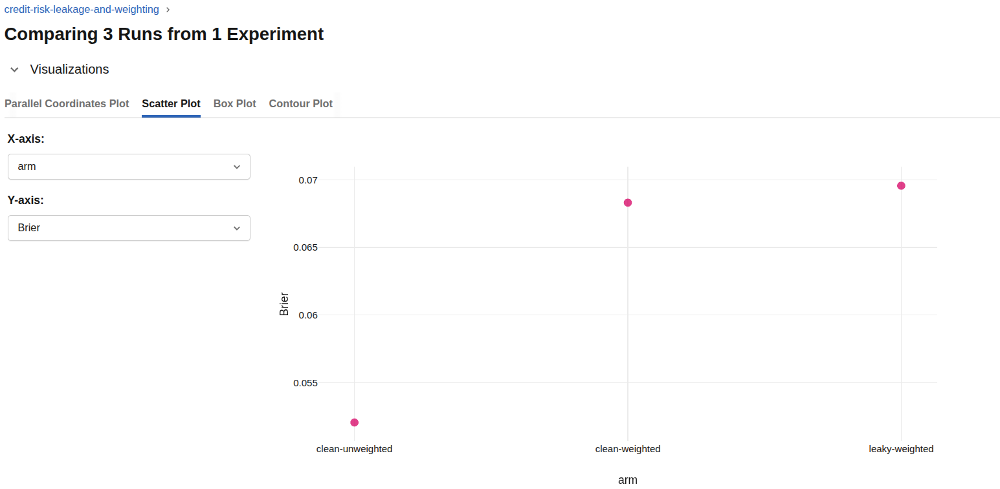
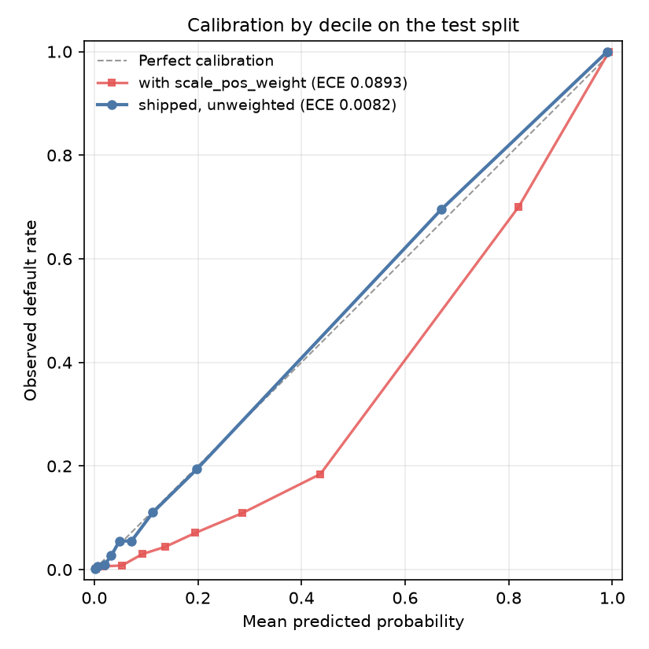
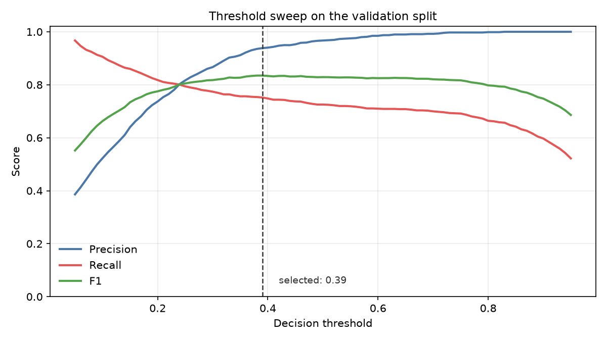
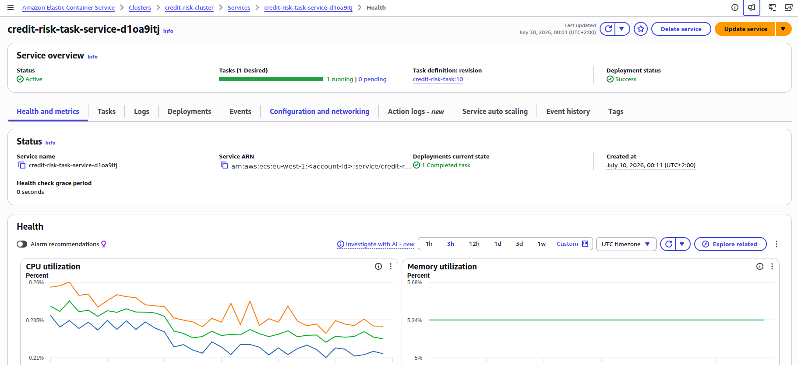
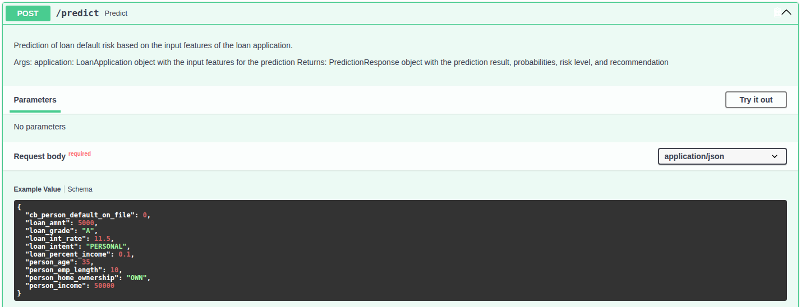
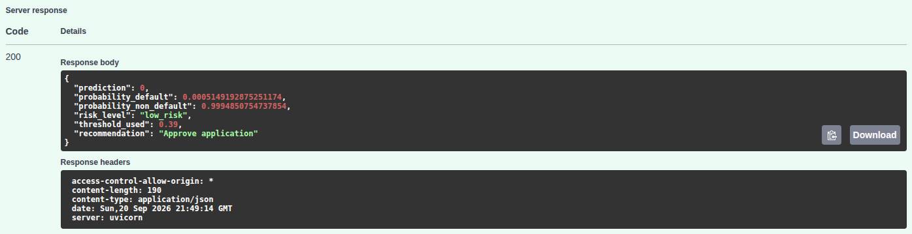

# Credit Risk Engine

Probability-of-default scoring for consumer loans: a calibrated XGBoost model served as a FastAPI
service, containerised and deployed to AWS ECS Fargate.

[](https://github.com/AntonioAlbaladejo/credit-risk-engine/actions/workflows/ci.yml)
[](https://www.python.org/downloads/)
[](LICENSE)
[](https://github.com/astral-sh/ruff)

---

## Overview

Given a loan application — income, employment, home ownership, requested amount, interest rate,
credit history — the service returns the probability of default, a binary decision at a tuned
threshold, and the threshold it used.

Trained on 31,679 historical applications at a 21.5% default rate, it reaches **0.9495 ROC-AUC** and
**0.9051 PR-AUC** on a held-out test split at an expected calibration error of **0.0082** — close
enough to read the output as a real probability rather than an arbitrary score. That is the point of
the design: a calibrated score can be repriced, turned into expected loss, or moved to a different
operating point without retraining. A binary yes/no cannot.

---

## Results

Measured on the 6,336-row test split, held out from every `fit` call and from the threshold search.
Seed `42` throughout. XGBoost, `max_depth=4`, `n_estimators=300`, no class weighting, threshold 0.39,
24 features.

| ROC-AUC | PR-AUC | Brier ↓ | Calibration error ↓ | Recall | Precision | F1 |
|---|---|---|---|---|---|---|
| **0.9495** | **0.9051** | **0.0516** | **0.0082** | 0.7560 | 0.9348 | 0.8360 |

At the tuned threshold the model catches 75.6% of real defaults, and 93.5% of the applications it
rejects would have defaulted. Mean predicted probability is 0.2153 against an observed rate of
0.2154.

### Model selection

Four algorithms under an identical pipeline — same split, same preprocessor, same 24 features, no
imbalance handling anywhere — so the only variable between rows is the algorithm.

| Model | ROC-AUC | PR-AUC | Brier ↓ | Precision | Recall | F1 |
|---|---|---|---|---|---|---|
| Logistic Regression | 0.8750 | 0.7398 | 0.0986 | 0.6771 | 0.6960 | 0.6864 |
| Random Forest | 0.9315 | 0.8843 | 0.0565 | 0.9416 | 0.7436 | 0.8309 |
| **XGBoost** | **0.9495** | **0.9051** | **0.0516** | **0.9348** | **0.7560** | **0.8360** |
| SVM (RBF) | 0.9041 | 0.8464 | 0.0693 | 0.8738 | 0.6952 | 0.7744 |

XGBoost wins every column, so the choice hides no trade-off. Logistic regression is the informative
loser: trailing by 7.5 ROC-AUC and 17 PR-AUC points says the boundary is genuinely non-linear —
grade, intent and home ownership interact with loan-to-income rather than adding up.

Regenerate with `uv run python scripts/train.py [--baselines]`, which writes
[`baseline_comparison.csv`](results/baseline_comparison.csv) and
[`leakage_and_weighting_comparison.csv`](results/leakage_and_weighting_comparison.csv).

---

## Design decisions

### Every `fit` happens inside the training split

The preprocessor, feature selector and threshold search see training or validation data only; test is
touched once, at the end. An earlier notebook pipeline fitted and selected over the full dataset
first.

| Arm | ROC-AUC | PR-AUC | Brier ↓ | Mean predicted | Threshold |
|---|---|---|---|---|---|
| Old pipeline: leaky + weighted | 0.9492 | 0.9046 | 0.0682 | 0.3035 | 0.70 |
| Clean split + weighted | 0.9492 | 0.9046 | 0.0682 | 0.3035 | 0.70 |
| **Clean split, unweighted** (shipped) | **0.9495** | **0.9051** | **0.0516** | **0.2153** | 0.39 |



Measured side by side the leak did **not** inflate the metrics — the leaky arm scored marginally
worse — but the methodology was wrong regardless, and a pipeline that is only accidentally correct
will not stay correct. Each arm is an MLflow run with `leaky` and `weighted` logged as separate
parameters, so either factor can be isolated: fixing the leak alone moves Brier almost nothing, while
dropping the weighting moves it a long way.

### No SMOTE, and no class weighting either

At 21.5% positives (3.64:1) the imbalance is mild. Three SMOTE variants were measured and all three
degraded ROC-AUC and PR-AUC; 15% of the synthetic rows carried a `loan_grade` block that was not a
valid one-hot, because interpolating over already-encoded columns invents categories that do not
exist. And once the threshold is tuned every arm converges to an F1 between 0.8370 and 0.8447 — the
benefit oversampling promises is what threshold tuning already delivers.



Class weighting was then dropped for calibration. Both curves come from the same algorithm, features
and split; only `scale_pos_weight` differs. The weighted model systematically over-predicts risk —
calibration error 0.0893 against 0.0082 — and gives up 0.0003 ROC-AUC for it. It pushes mean
predicted probability to 0.3035 against a true rate of 0.2154, dragging the optimal threshold to
0.70. Unweighted, no decile deviates more than 2.5 points and Brier improves by 24%.

### The threshold is a tuned artifact, not 0.5



It is chosen on the **validation** split by maximising F1, then applied unchanged to test — picking
it on test would leak the test set into the reported operating point. The curve is flat between
roughly 0.3 and 0.7, so the cut-off can be moved on business grounds without collapsing the model
([full sweep](results/threshold_optimization.csv)). The service returns `threshold_used` in every
response rather than leaving the caller to assume.

### Training and serving share one implementation

`create_derived_features()` in [`src/preprocessing.py`](src/preprocessing.py) is imported by both the
training script and the serving path. It previously existed twice and the copies had already drifted
— different zero-division handling, different bucket dtypes. That is train/serve skew: it produces no
error and no failing test, just quietly wrong predictions.

The preprocessor, feature list, model and threshold are likewise one versioned bundle, produced by a
single run and loaded together at startup. MLflow lookup is opt-in, so an unreachable tracking server
degrades to the local artifacts instead of blocking startup for 247 seconds of retry backoff.

---

## Architecture and delivery


CD triggers only on a successful CI run, builds the image, **starts the container and calls
`/health` and `/predict` against it**, then pushes to ECR and deploys to Fargate. That container
check matters more than it looks: the step it replaced ran `python -c "import src"`, which passes
even when the model artifacts are missing from the image entirely.



---

## Running it

Requires Python 3.11+ and [uv](https://docs.astral.sh/uv/getting-started/installation/).

```bash
git clone https://github.com/AntonioAlbaladejo/credit-risk-engine.git
cd credit-risk-engine
uv sync --all-groups
uv run uvicorn src.api.main:app --reload --port 8000   # docs at :8000/docs
```

```bash
curl -X POST http://localhost:8000/predict \
  -H 'Content-Type: application/json' \
  -d '{"person_age": 23, "person_income": 24000, "person_home_ownership": "RENT",
       "person_emp_length": 1, "loan_intent": "DEBTCONSOLIDATION", "loan_grade": "E",
       "loan_amnt": 12000, "loan_int_rate": 16.0, "loan_percent_income": 0.5,
       "cb_person_default_on_file": 1}'
```

```json
{
  "prediction": 1,
  "probability_default": 0.9998000264167786,
  "risk_level": "high_risk",
  "threshold_used": 0.39,
  "recommendation": "Reject application"
}
```

The Docker image carries the model artifacts, so a fresh clone builds a container that serves real
predictions and becomes healthy in about 8 seconds.

```bash
docker build -t credit-risk-engine:local . && docker run --rm -p 8000:8000 credit-risk-engine:local
uv run pytest                                           # 117 tests, ~4.5s
uv run python scripts/train.py --baselines              # reproduce the comparison tables
uv run python scripts/train.py --save clean-unweighted  # promote a run to models/
```

---

## API

| Method | Endpoint | Description |
|---|---|---|
| `GET` | `/health` | `200` when the model is loaded, `503` when it is not |
| `GET` | `/model/info` | Model type, threshold, and the 24 feature names in order |
| `POST` | `/predict` | Score one application |
| `POST` | `/predict/batch` | Score up to 100 applications in one call |
| `GET` | `/docs` · `/redoc` | OpenAPI documentation |





Pydantic v2 schemas are the contract and FastAPI generates the documentation from them, so it cannot
drift from what the service accepts, and requests can be sent straight from the page. Bounds live in
[`src/config.py`](src/config.py) to match the ranges seen in training: `loan_int_rate` has a floor
of 1.0 rather than 0 because training data runs
5.42 to 23.22 in percent units, so a caller sending a fraction (`0.08` for 8%) is rejected with a
`422` rather than silently scaled 3.5 standard deviations below anything the model has seen.
`/health` returns `503` rather than `200` with an `unhealthy` body because a load balancer reads the
status code, not a payload.

---

## Stack and data

| Layer | Tools |
|---|---|
| Modelling | XGBoost, scikit-learn, pandas, NumPy |
| Tracking · monitoring | MLflow, Evidently |
| Serving | FastAPI, Pydantic v2, uvicorn |
| Packaging · quality | uv, Docker multi-stage, pytest, ruff |
| Delivery | GitHub Actions, Amazon ECR, ECS Fargate (eu-west-1) |

The [Credit Risk Dataset](https://www.kaggle.com/datasets/laotse/credit-risk-dataset) from Kaggle:
32,581 loan applications, 11 features, binary `loan_status` target. Cleaning leaves **31,679 rows at
a 21.5% default rate** (3.64:1). Feature engineering adds five derived columns, expanding to 40 after
one-hot encoding; a three-stage filter (correlation, tree importance, variance) fitted on the
training split alone reduces that to 18, and one-hot blocks left partially selected are then restored
whole, giving the **24 features** the model uses. Raw data is not committed.

---

## Limitations and open work

- **Most of the suite mocks `joblib.load` with an autouse fixture**, so it exercises the code paths
  rather than the shipped model. `tests/test_inference_real.py` opts out of that mock and pins six
  known applications to the probabilities the real bundle assigns them, which is what catches a
  reordered feature list or a preprocessor from a different run; the rest still proves nothing about
  the artifacts.
- **The container is 2.94 GB**, down from 4.08 GB, dominated by `mlflow`, `evidently`, `seaborn` and
  an unused CUDA library in the runtime dependency set.
- **CORS is wide open** (`allow_origins=["*"]`) and the Evidently report compares against a
  three-row hand-written reference file, so its drift numbers are not meaningful yet.

---

## License

MIT — see [LICENSE](LICENSE).

## Author

**Antonio Albaladejo Soriano** ·
[LinkedIn](https://www.linkedin.com/in/antonio-albaladejo-soriano-3133211b7/)
