# Credit Risk Engine

End-to-end machine learning system that predicts the **probability that a consumer loan will
default**, explains every decision in plain reason codes, and runs as a containerised API on **AWS
ECS Fargate** behind a tested CI/CD pipeline. A retrieval layer (RAG) answers which **GDPR** and
**EU AI Act** provisions apply to a credit decision, citing the law, or declines when the law
doesn't cover the question.

[](https://github.com/AntonioAlbaladejo/credit-risk-engine/actions/workflows/ci.yml)
[](https://github.com/AntonioAlbaladejo/credit-risk-engine/actions/workflows/cd.yml)
[](https://www.python.org/downloads/)
[](LICENSE)
[](https://github.com/astral-sh/ruff)

[Highlights](#highlights) · [Architecture](#architecture) · [Data](#data) ·
[Modelling](#modelling) · [Results](#results) · [Key decisions](#key-decisions) ·
[Explainability](#explainability) · [API](#api-and-quickstart) · [Deployment](#deployment) ·
[Regulatory search](#regulatory-search-rag) · [Limitations](#limitations-and-next-steps)

---

## Highlights

- **Accurate and calibrated model.** XGBoost on 31,679 loan applications. On a held-out test set:
  **ROC-AUC 0.95 · PR-AUC 0.91**. It catches **76% of defaults**, and **93%** of the applications
  it rejects really do default. Its probabilities match observed default rates (calibration error
  0.008), so the score can be used as a real probability of default.
- **Leak-free methodology.** Stratified train/validation/test split; every scaler, encoder and
  feature selector fitted on training data only; decision threshold tuned on validation; test set
  used once. Seed `42` throughout.
- **Explainable decisions.** Each score is broken down with SHAP into reason codes such as
  *affordability*, *loan grade* and *interest rate*.
- **Production API.** FastAPI + Pydantic v2, with input bounds taken from the training data, a
  real health check and per-client rate limiting.
- **CI/CD to AWS.** GitHub Actions → Docker → Amazon ECR → ECS Fargate. The image is started and
  called before it is pushed, so a broken build never reaches production.
- **MLOps.** MLflow experiment tracking, a single versioned model bundle, an Evidently monitoring
  report.
- **GenAI layer.** RAG over 759 passages of the GDPR and the EU AI Act: the correct provision
  appears in the top 5 for **98% of held-out questions**. Exposed to LLM clients through an
  **MCP server** and to everyone else through a REST endpoint.
- **Tested.** 195 pytest tests, 11 of them against the real model artifacts; ruff-clean.

Model metrics are reproduced by `scripts/train.py` (tables in [`results/`](results/)), figures by
`scripts/plot_results.py`, and retrieval metrics by `scripts/evaluate_retrieval.py`.

---

## Architecture

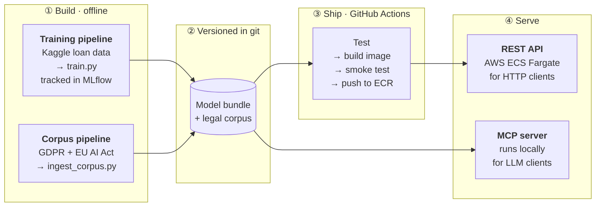
```mermaid
flowchart LR
    subgraph build["① Build · offline"]
        train["<b>Training pipeline</b><br/>Kaggle loan data<br/>→ train.py<br/>tracked in MLflow"]
        ingest["<b>Corpus pipeline</b><br/>GDPR + EU AI Act<br/>→ ingest_corpus.py"]
    end

    subgraph git["② Versioned in git"]
        artifacts[("Model bundle<br/>+ legal corpus")]
    end

    subgraph ship["③ Ship · GitHub Actions"]
        cicd["Test<br/>→ build image<br/>→ smoke test<br/>→ push to ECR"]
    end

    subgraph serve["④ Serve"]
        api["<b>REST API</b><br/>AWS ECS Fargate<br/>for HTTP clients"]
        mcp["<b>MCP server</b><br/>runs locally<br/>for LLM clients"]
    end

    train --> artifacts
    ingest --> artifacts
    artifacts --> cicd --> api
    artifacts ---> mcp
```

1. **Build.** Two offline pipelines turn raw sources into artifacts. `scripts/train.py` engineers
   features, splits, trains and tunes the threshold, logging every run to MLflow;
   `scripts/ingest_corpus.py` splits the two acts into passages and embeds them.
2. **Versioned.** The model bundle (preprocessor, model, feature list, threshold) and the legal
   corpus with its vector index are committed, so any fresh checkout, CI's included, has everything
   needed to serve.
3. **Ship.** Every push to `main` is tested, built into a Docker image, started and called as a
   smoke test, pushed to Amazon ECR and deployed. Details in [Deployment](#deployment).
4. **Serve.** The REST API on ECS Fargate scores applications and searches the law for HTTP
   clients. The MCP server gives LLM clients such as Claude the same model and corpus, running on
   the user's machine.

---

## Data

The [Credit Risk Dataset](https://www.kaggle.com/datasets/laotse/credit-risk-dataset) from Kaggle:
32,581 loan applications with applicant data (age, income, home ownership, employment length,
credit history) and loan data (amount, purpose, grade, interest rate). The target is `loan_status`,
default or not. After cleaning: **31,679 rows, 21.5% defaults**, a mild 3.6 : 1 imbalance.

What the exploratory analysis showed:

- **Home ownership separates risk sharply:** renters default at 31.1%, owners under 7%.
- **Loan grade is close to a risk ladder:** grade B defaults at 15.9%, grade F at 70.3%, grade G
  at 98.4%.
- **Some inputs are redundant:** age and credit history length correlate at 0.88, so only one is
  kept and the API does not ask for the other.
- **Several numeric features are skewed with many outliers.** A log transform fixes that, but it is
  kept as a diagnostic only: the tree model selected does not need it.

The analysis lives in four notebooks: [ingestion](notebooks/data_ingestion.ipynb) ·
[EDA](notebooks/exploratory_data_analysis.ipynb) ·
[feature engineering](notebooks/feature_engineering.ipynb) ·
[model selection](notebooks/model_selection.ipynb). Production code lives in `src/` and
`scripts/`; the notebooks explore and explain, and nothing ships from them. The raw data is not
committed.

---

## Modelling

`scripts/train.py` runs the whole pipeline end to end and logs every run to MLflow:

1. **Feature engineering.** Loan-to-income and employment-to-age ratios, age and employment-length
   buckets, and a binary prior-default flag. The same function runs in training and in the API.
2. **Stratified split** into train / validation / test (64 / 16 / 20).
3. **Preprocessing fitted on train only.** Median imputation + scaling for numeric columns,
   most-frequent imputation + one-hot encoding for categorical ones: 40 columns.
4. **Feature selection fitted on train only.** Correlation, tree importance and variance filters
   reduce 40 columns to 18; one-hot groups the filters had split are then restored whole, giving
   **24 features**. The engineered ratios and buckets did not survive: `loan_to_income`, for
   instance, correlates 0.9989 with the existing `loan_percent_income`.
5. **Four algorithms compared** under that identical pipeline. The best two were tuned with
   `GridSearchCV` in the model-selection notebook, keeping the simplest configuration within one
   standard error of the best cross-validated PR-AUC. The final model is XGBoost (`max_depth=4`,
   `n_estimators=300`, `learning_rate=0.1`, `subsample=0.8`).
6. **Decision threshold** chosen on the validation set by maximising F1, then applied unchanged to
   the test set, which is evaluated once.

---

## Results

Held-out test set, 6,336 applications, threshold 0.39.

| ROC-AUC | PR-AUC | Brier ↓ | Calibration error ↓ | Recall | Precision | F1 |
|---|---|---|---|---|---|---|
| **0.9495** | **0.9051** | **0.0516** | **0.0082** | 0.7560 | 0.9348 | 0.8360 |

In business terms: the model flags **75.6% of the loans that will default**, and **93.5% of the
loans it flags do default**. The average predicted probability (21.53%) matches the real default
rate (21.54%).

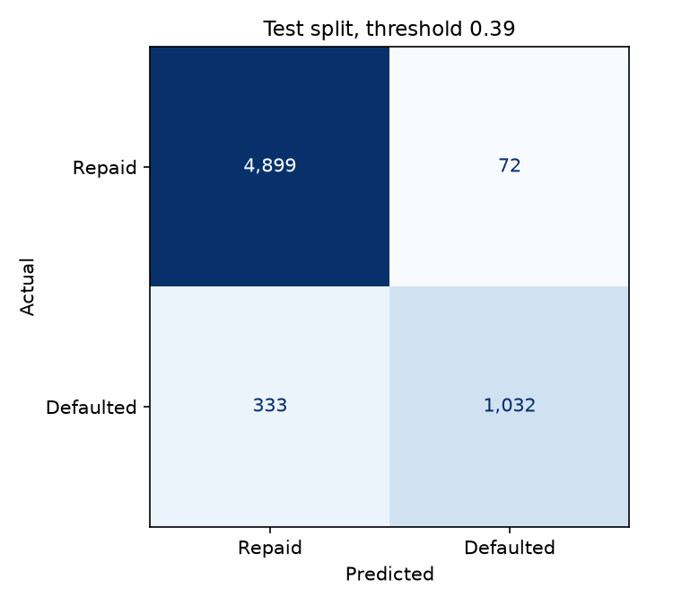

Of 1,365 defaults in the test set, 1,032 are caught and 333 missed; only 72 of 4,971 good loans are
wrongly rejected.

### Model selection

Same split, same preprocessing, same 24 features: only the algorithm changes. Each model gets its
own threshold, tuned on validation the same way.

| Model | ROC-AUC | PR-AUC | Brier ↓ | Precision | Recall | F1 |
|---|---|---|---|---|---|---|
| Logistic Regression | 0.8750 | 0.7398 | 0.0986 | 0.6771 | 0.6960 | 0.6864 |
| Random Forest | 0.9315 | 0.8843 | 0.0565 | **0.9416** | 0.7436 | 0.8309 |
| **XGBoost** | **0.9495** | **0.9051** | **0.0516** | 0.9348 | **0.7560** | **0.8360** |
| SVM (RBF) | 0.9041 | 0.8464 | 0.0693 | 0.8738 | 0.6952 | 0.7744 |

XGBoost wins on every threshold-independent metric (ROC-AUC, PR-AUC, Brier) and on recall and F1;
Random Forest is slightly more precise at its own threshold. Logistic regression trails by 7.5
ROC-AUC points, a sign that the relationship between features and default is clearly non-linear.

<p>
  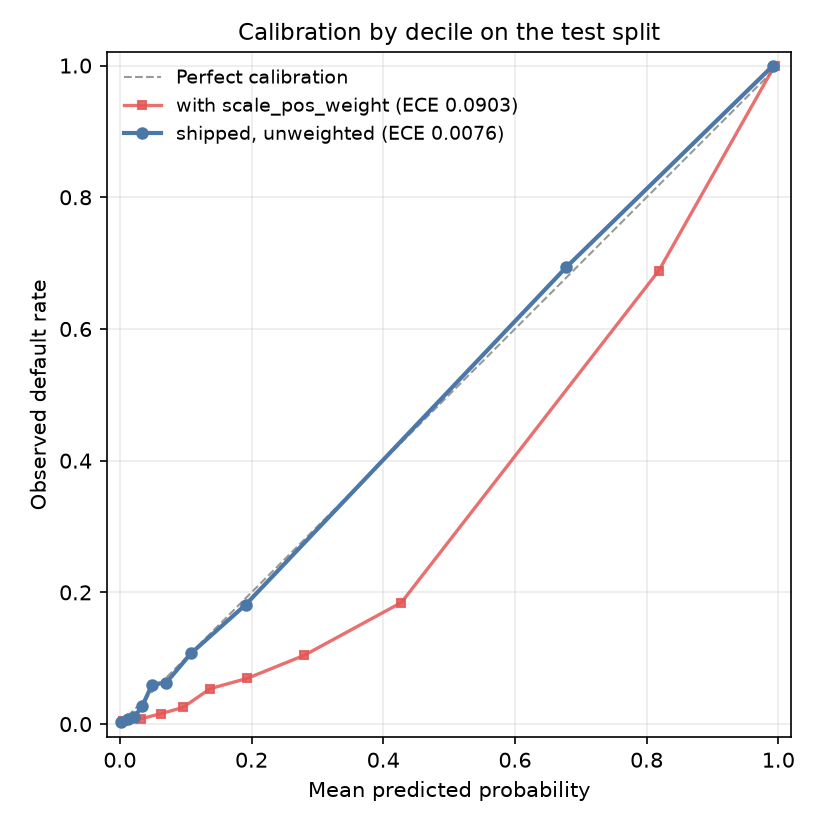
  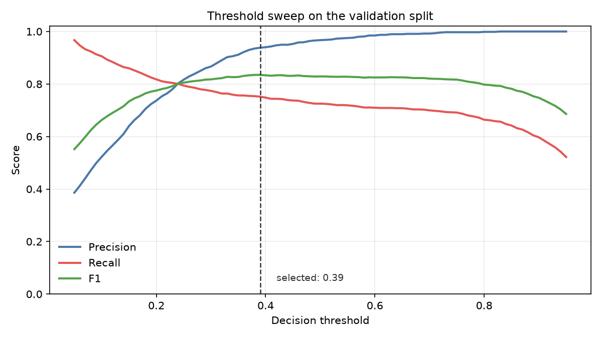
</p>

**Left:** predicted vs. observed default rate per decile. The shipped model sits on the diagonal;
the class-weighted alternative over-predicts risk. **Right:** precision, recall and F1 across
thresholds. F1 is flat between roughly 0.3 and 0.7, so the cut-off can move on business grounds
without breaking the model ([full sweep](results/threshold_optimization.csv)).

---

## Key decisions

**No data leakage.** An earlier notebook version fitted the preprocessing and feature selection on
the full dataset before splitting. The current pipeline fits everything on training data only. Both
versions were run side by side and produced identical test metrics, so no reported number was
inflated; the fix is about correctness, because a pipeline that is only accidentally right does not
stay right.

**Calibration over class weighting, and no SMOTE.** With 21.5% defaults the imbalance is mild.
`scale_pos_weight` inflated the average predicted risk to 30% against a real 21.5% without
improving ranking (ROC-AUC 0.9492 vs 0.9495); dropping it improved the Brier score by 24%. In an
earlier comparison on the previous 18-feature pipeline, three SMOTE variants all lowered ROC-AUC
and PR-AUC, and 15% of the synthetic rows had impossible one-hot values (no valid loan grade).
Tuning the threshold gives the recall benefit without distorting the probabilities.

| Experiment | ROC-AUC | PR-AUC | Brier ↓ | Avg. predicted | Threshold |
|---|---|---|---|---|---|
| Leaky pipeline + class weighting | 0.9492 | 0.9046 | 0.0682 | 0.3035 | 0.70 |
| Leak-free + class weighting | 0.9492 | 0.9046 | 0.0682 | 0.3035 | 0.70 |
| **Leak-free, no weighting** (shipped) | **0.9495** | **0.9051** | **0.0516** | **0.2153** | 0.39 |

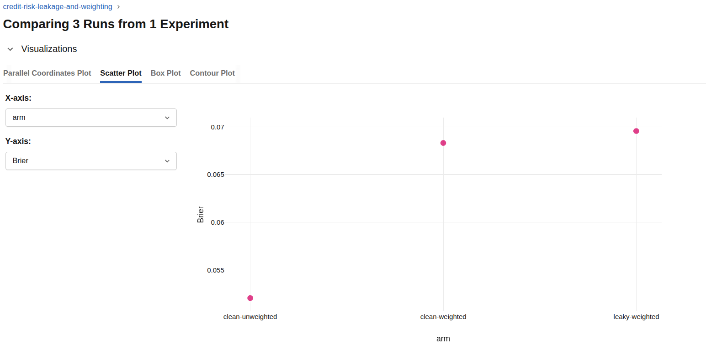

**Keep one-hot groups whole.** The selection filters score one column at a time and had dropped
grades B, F and G, merging them into a single category that was 97% grade B. Grades F (70% default
rate) and G (98%) were being scored like B (16%). Aggregate metrics did not move, because F and G
are under 1% of the data, which is exactly why it needed checking. Restoring whole groups fixed it.

**One feature-engineering implementation for training and serving.** There used to be two copies,
and they had already drifted apart (different zero-division handling, different data types). That
kind of train/serve skew raises no error and fails no test; it just produces wrong predictions. Now
both paths import the same function, and the preprocessor, model, feature list and threshold are
saved and loaded together as one versioned bundle.

---

## Explainability

[`src/explainer.py`](src/explainer.py) computes exact TreeSHAP contributions for each application
and groups them into six reason codes: **affordability, loan grade, interest rate, stability, loan
purpose, credit history**.

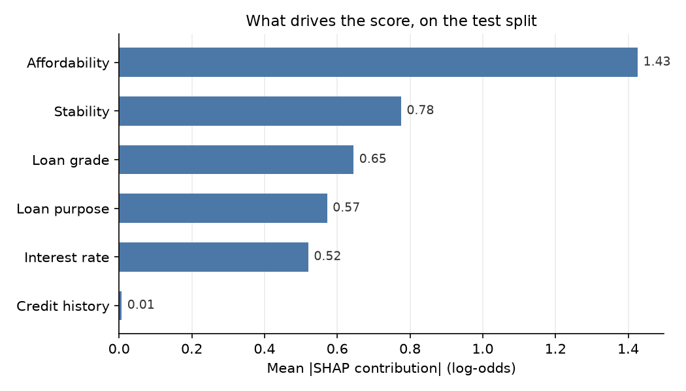

Across the test set, **affordability** (income, amount, share of income) moves the score most. A
prior default on file barely moves it, because the lender's grade already carries that signal: no
grade A or B loan has one, against about half of grades C to G.

The reasons are served through the MCP tool `assess_loan_application`, which returns only the
probability, the decision and the reason codes, so an LLM client explains a decision with figures
the model computed instead of inventing its own:

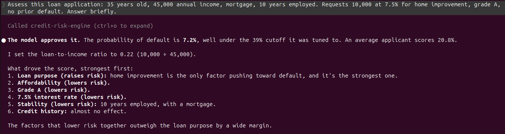

---

## API and quickstart

Requires [uv](https://docs.astral.sh/uv/getting-started/installation/), which installs Python 3.11
automatically.

```bash
git clone https://github.com/AntonioAlbaladejo/credit-risk-engine.git
cd credit-risk-engine
uv sync --all-groups
uv run uvicorn src.api.main:app --port 8000      # interactive docs at localhost:8000/docs
```

Or with Docker. The image already contains the model, the legal corpus and the embedding model:

```bash
docker build -t credit-risk-engine . && docker run --rm -p 8000:8000 credit-risk-engine
```

Score an application:

```bash
curl -X POST http://localhost:8000/predict \
  -H 'Content-Type: application/json' \
  -d '{"person_age": 23, "person_income": 24000, "person_home_ownership": "RENT",
       "person_emp_length": 1, "loan_intent": "DEBTCONSOLIDATION", "loan_grade": "E",
       "loan_amnt": 12000, "loan_int_rate": 16.0, "loan_percent_income": 0.5,
       "cb_person_default_on_file": 1}'
```

```json
{
  "prediction": 1,
  "probability_default": 0.9998,
  "probability_non_default": 0.0002,
  "risk_level": "high_risk",
  "threshold_used": 0.39,
  "recommendation": "Reject application"
}
```

*(Probabilities rounded here; the API returns full precision.)*

| Method | Endpoint | Description |
|---|---|---|
| `GET` | `/health` | `200` only when the model is loaded, `503` otherwise |
| `GET` | `/model/info` | Model type, threshold and the 24 features in order |
| `POST` | `/predict` | Score one application |
| `POST` | `/predict/batch` | Score up to 100 applications |
| `POST` | `/regulation/search` | GDPR / AI Act passages relevant to a question, with citations |
| `GET` | `/docs` · `/redoc` | OpenAPI documentation, generated from the Pydantic schemas |

- **Validation from training ranges.** Input bounds live in [`src/config.py`](src/config.py) and
  match the data the model saw. For example, `loan_int_rate` must be a percentage (8.0, not 0.08):
  a fraction gets a `422` instead of a silently wrong score.
- **Rate limiting.** 60 requests per minute per client (`429` with `Retry-After`); `/health` is
  exempt because ECS uses it to keep the task alive.

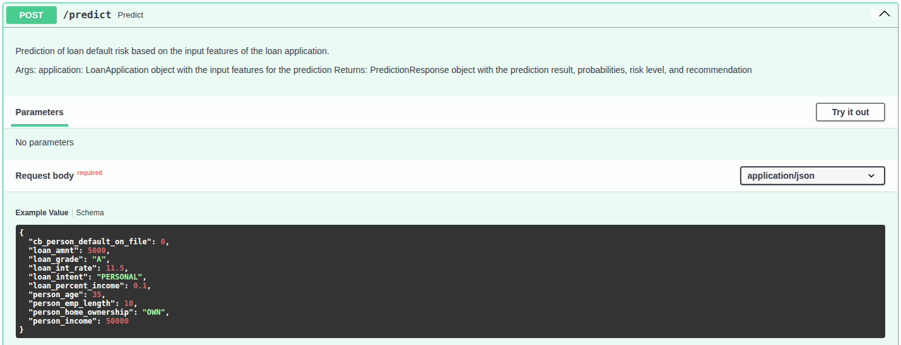

Other useful commands. Retraining and monitoring need the dataset in `data/`: run the
[ingestion](notebooks/data_ingestion.ipynb) and
[feature engineering](notebooks/feature_engineering.ipynb) notebooks first (Kaggle credentials
required).

```bash
uv run pytest                                           # 195 tests
uv run python scripts/train.py --baselines              # reproduce the comparison tables
uv run python scripts/train.py --save clean-unweighted  # promote a run to models/
uv run mlflow ui --backend-store-uri sqlite:///mlflow.db   # browse experiments at :5000
uv run python -m src.model_monitoring                   # Evidently report -> results/
```

---

## Deployment

Every push to `main` that passes CI goes through this pipeline in GitHub Actions:

1. **CI:** ruff lint and format check, then the full pytest suite with coverage.
2. **Build** the Docker image (multi-stage; MLflow, Evidently and other dev tools stay out of it).
3. **Smoke test the real image:** start the container, call `/health`, `/predict` and
   `/regulation/search`, then run it again with **no network** to prove nothing is downloaded at
   startup.
4. **Push** to Amazon ECR and **deploy** a new task definition to ECS Fargate (eu-west-1), waiting
   until the service is stable.

Step 3 replaced a check that only ran `import src`, which passes even when the model files are
missing from the image. Because Fargate gives each new task a new IP, an EventBridge rule triggers a
small Lambda ([`infra/dns_updater/`](infra/dns_updater/)) that keeps a stable hostname pointing at
the running task. A live instance is available on request.

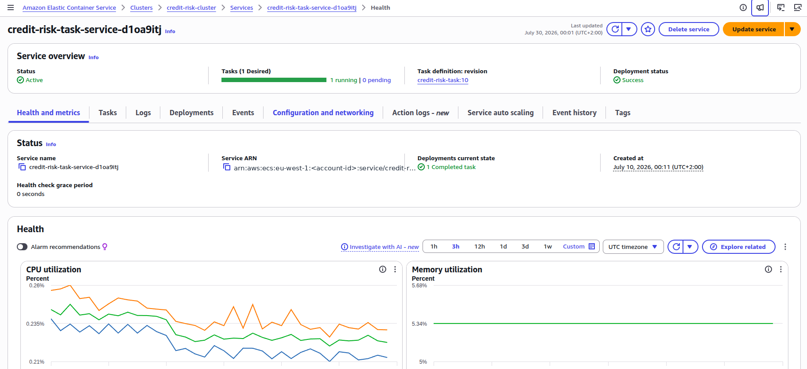

---

## Regulatory search (RAG)

A credit model is subject to the GDPR (automated decisions, Article 22) and the EU AI Act (credit
scoring is high-risk). This layer retrieves the provisions relevant to a question, each with its
citation, source URL and retrieval date, so every answer can be checked against EUR-Lex.

- **Corpus.** Both acts from EUR-Lex, split along their legal structure (article, recital, annex)
  into **759 passages**, none truncated.
- **Retrieval.** Dense embeddings (`BAAI/bge-small-en-v1.5`, via fastembed) with an exact cosine
  search. Recitals are ranked below articles, which are the binding text.
- **HyDE.** Users ask in business language the law never uses (*postal code*, *AUC*, *vendor*). The
  calling LLM first writes the passage it expects to find, and the search matches on that.
  Held-out hit-rate@5 rises from **72% to 98%**, and holds with a second, independently written set
  of passages.
- **Knowing when not to answer.** Below a tuned similarity threshold, or when the question asks
  *what did we do* instead of *what does the law require*, the tool returns no passages and says
  why. A citation that looks relevant but isn't is worse than no answer.
- **Measured, not assumed.** A hand-labelled set of **161 questions** (a third deliberately
  unanswerable) split into fitting and held-out parts. On the 67 held-out questions, the full path
  gives the right outcome (correct passage or correct refusal) for **48**, against 39 for the
  baseline path.

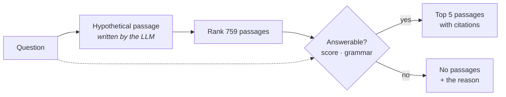
```mermaid
flowchart LR
    q["Question"] --> hp["Hypothetical passage<br/><i>written by the LLM</i>"] --> rank["Rank 759 passages"] --> veto{"Answerable?<br/>score · grammar"}
    q -.-> veto
    veto -->|yes| ans["Top 5 passages<br/>with citations"]
    veto -->|no| quiet["No passages<br/>+ the reason"]
```

The same search is available to LLM clients (Claude Desktop, Claude Code…) through an
[MCP server](src/mcp_server.py) and to any HTTP client through `POST /regulation/search`; both share
one payload builder, so they never drift apart. [`.mcp.json`](.mcp.json) registers the server for
any MCP client opened in this repo.

<p>
  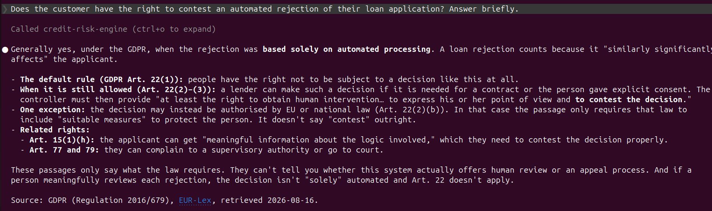
  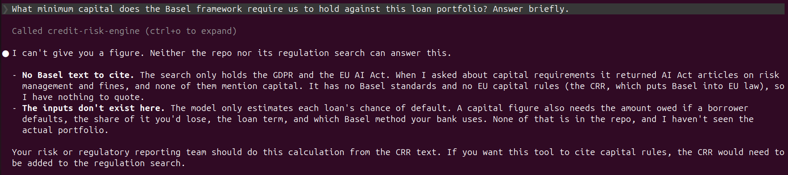
</p>

**Left:** a question about contesting an automated rejection, answered with GDPR Article 22 and
related provisions. **Right:** a question about Basel capital requirements, which these two acts do
not cover. The tool returns nothing and the client says so instead of inventing a figure.

<details>
<summary><b>Alternatives built, measured and dropped</b></summary>

Each was implemented and evaluated on the same question set, with thresholds re-fitted for it.

| Variant | Why it was dropped |
|---|---|
| BM25 + dense hybrid | Worse at every weighting: the words that matter in real questions never appear in the law |
| Cross-encoder reranker (3 models) | 1 GB and 5.8 s per query, and *worse* at knowing when to abstain |
| Larger embedding models (5) | None beat `bge-small` on the held-out set; 15–37× slower per query |
| Adding an internal credit policy to the corpus | 1.9% of passages took 28.7% of top-5 slots; wrong citations rose from 9 to 20 |
| Expanding cross-references | Doubled the returned text and tripled over-claiming by the LLM |
| Separate heading vectors | No weighting improved retrieval |
| A second abstention check (ranking agreement) | Looked better on a small set; lost on 7 of 8 seeds once re-tested |

</details>

---

## Monitoring

[`src/model_monitoring.py`](src/model_monitoring.py) builds an Evidently report (data drift +
classification quality) that scores the training and test sets with the shipped model at its tuned
threshold. Requests to the live service are not logged yet, so the report checks the pipeline, not
production traffic; capturing requests is the next step.

---

## Project structure

```text
src/
  preprocessing.py     feature engineering + input validation (shared by training and serving)
  predictor.py         loads the versioned bundle and scores applications
  explainer.py         SHAP reason codes
  retriever.py         legal corpus search (RAG)
  mcp_server.py        MCP tools for LLM clients
  model_monitoring.py  Evidently report
  api/                 FastAPI app and Pydantic schemas
scripts/               train.py · ingest_corpus.py · evaluate_retrieval.py · plot_results.py
notebooks/             ingestion → EDA → feature engineering → model selection
models/                the versioned model bundle served by the API
corpus/                legal passages, vector index and the labelled question set
results/               comparison tables behind the model metrics in this README
infra/dns_updater/     Lambda that keeps a stable hostname for the Fargate task
tests/                 pytest suite
.github/workflows/     ci.yml · cd.yml
```

---

## Tech stack

| Area | Tools |
|---|---|
| Data & modelling | pandas, NumPy, scikit-learn, XGBoost (with its built-in TreeSHAP), matplotlib |
| Experiment tracking & monitoring | MLflow, Evidently |
| Serving | FastAPI, Pydantic v2, uvicorn |
| GenAI | fastembed (`bge-small-en-v1.5`), MCP SDK |
| Engineering | uv, Docker (multi-stage), pytest, ruff |
| Cloud & CI/CD | GitHub Actions, Amazon ECR, ECS Fargate, Lambda, EventBridge |

---

## Limitations and next steps

- **Most tests mock the model.** Model loading is mocked by default, so the suite checks code
  paths rather than the shipped model; the 11 tests in
  [`tests/test_inference_real.py`](tests/test_inference_real.py) load the real bundle and pin known
  applications to their probabilities.
- **Grade F is slightly under-predicted** (by 6.8 points on 51 test rows). One-hot encoding shares
  nothing between neighbouring grades; an ordinal encoding with monotonic constraints is the next
  experiment.
- **The retrieval layer is better at answering than at abstaining.** It correctly refuses 7 of the
  18 held-out questions it should refuse. The held-out questions have also been read many times, so
  a fresh question set is needed for an unbiased figure.
- **No production feedback loop yet.** Live requests are not logged, so there is no drift
  monitoring on real traffic and no record of what users ask the regulatory search.
- **Light network hardening.** The service runs over plain HTTP with a per-client rate limit and
  no load balancer; TLS and a WAF would come with an Application Load Balancer and a domain.

---

## License

MIT, see [LICENSE](LICENSE).

## Author

**Antonio Albaladejo Soriano** · [LinkedIn](https://www.linkedin.com/in/antonio-albaladejo-soriano-3133211b7/)
